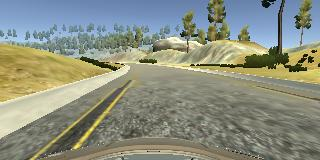
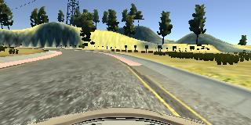

# **Behavioral Cloning** 


---

**Behavioral Cloning Project**

The goals / steps of this project are the following:
* Use the simulator to collect data of good driving behavior
* Build, a convolution neural network in Keras that predicts steering angles from images
* Train and validate the model with a training and validation set
* Test that the model successfully drives around track one without leaving the road
* Summarize the results with a written report


[//]: # (Image References)

[image1]: ./examples/placeholder.png "Model Visualization"
[image2]: ./examples/placeholder.png "Grayscaling"
[image3]: ./examples/placeholder_small.png "Recovery Image"
[image4]: ./examples/placeholder_small.png "Recovery Image"
[image5]: ./examples/placeholder_small.png "Recovery Image"
[image6]: ./examples/placeholder_small.png "Normal Image"
[image7]: ./examples/placeholder_small.png "Flipped Image"

## Rubric Points
### Here I will consider the [rubric points](https://review.udacity.com/#!/rubrics/432/view) individually and describe how I addressed each point in my implementation.  

---
### Files Submitted & Code Quality

#### 1. Submission includes all required files and can be used to run the simulator in autonomous mode

My project includes the following files:
* model.py containing the script to create and train the model
* drive.py for driving the car in autonomous mode
* model.h5 containing a trained convolution neural network 
* writeup_report.md or writeup_report.pdf summarizing the results

#### 2. Submission includes functional code
Using the Udacity provided simulator and my drive.py file, the car can be driven autonomously around the track by executing 
```sh
python drive.py model.h5
```

#### 3. Submission code is usable and readable

The model.py file contains the code for training and saving the convolution neural network. The file shows the pipeline I used for training and validating the model, and it contains comments to explain how the code works.

### Model Architecture and Training Strategy

#### 1. An appropriate model architecture has been employed


My model consists of a 5 conv layers as described below  

* 24 5*5 conv layer with Stride of 2 with activation Relu
* 36 5*5 conv layer with Stride of 2 with activation Relu
* 48 5*5 conv layer with Stride of 2 with activation Relu
* 64 3*3 conv layer with activation Relu
* 64 3*3 conv layer with activation Relu


The model includes RELU layers to introduce nonlinearity, and the data is normalized in the model using a Keras lambda layer (code line 117).

I also used 2 fully connected layers of 100 and 50. However, adding Relu non linearity to FC layers was making Car to steer away from road.  

#### 2. Attempts to reduce overfitting in the model

I have not added dropout layer as my model was not overfitting. 

Training output
```
loss: 0.0146 - val_loss: 0.0256
```
 

The model was trained and validated (20% of data was split as validation)on different data sets to ensure that the model was not overfitting (code line 143). The model was tested by running it through the simulator and ensuring that the vehicle could stay on the track.

#### 3. Model parameter tuning

The model used an adam optimizer, so the learning rate was not tuned manually (model.py line 139).

#### 4. Appropriate training data

Training data was chosen to keep the vehicle driving on the road. I used a combination of center lane driving, recovering from the left and right sides of the road ... 

For details about how I created the training data, see the next section. 

### Model Architecture and Training Strategy

#### 1. Solution Design Approach

The overall strategy for deriving a model architecture was to make car drive on lane 1.


My first step was to use capture data using keyboard and try a simple convolution neural network model similar to the LeNet. Model was not working at all because test images were not smooth (because of keyboard).

Then I tried test data provided by Udacity.

In order to gauge how well the model was working, I split my image and steering angle data into a training and validation set (20 %). This model was worked well for half of the track then vehicle veered outside of the road.
Then I used data augmentation technique to flip data. This approach gave better result than prevous but still Car was veering off the road.

Finally I tried [NVIDIA Architecture](http://images.nvidia.com/content/tegra/automotive/images/2016/solutions/pdf/end-to-end-dl-using-px.pdf) as mentioned in the course.

This Model gave best result but Car was touching the border in some cases.

Then I captured recovery data for both left to centre and right to centre. After training Model with additional data model was working fine except one case where it was touching right side border.
I captured additional recovery data from right to center and trained model again. This resulted in Car driving smoothly on track 1.  


#### 2. Final Model Architecture

The final model architecture (model.py lines 18-24) consisted of a convolution neural network with the following layers and layer sizes ...

* 24 5*5 conv layer with Stride of 2 with activation Relu
* 36 5*5 conv layer with Stride of 2 with activation Relu
* 48 5*5 conv layer with Stride of 2 with activation Relu
* 64 3*3 conv layer with activation Relu
* 64 3*3 conv layer with activation Relu


#### 3. Creation of the Training Set & Training Process

To capture good driving behavior, I used data set provided by Udacity.


I then recorded the vehicle recovering from the left side and right sides of the road back to center so that the vehicle would learn to drive to center in case it's veered towards edges.These images show what a recovery looks like - 

****Left Recovery


****Right Recovery


Then I repeated this process on track two in order to get more data points.


After the collection process, I had 48360 number of data points. I then preprocessed this data by dividing by 255 using Keras Lambda


I finally randomly shuffled the data set and put 20% of the data into a validation set. 

I used this training data for training the model. The validation set helped determine if the model was over or under fitting. The ideal number of epochs was 3 as evidenced by log  

```
38688/38688 [==============================] - 47s - loss: 0.0189 - val_loss: 0.0260
Epoch 2/3
38688/38688 [==============================] - 43s - loss: 0.0157 - val_loss: 0.0246
Epoch 3/3
38688/38688 [==============================] - 44s - loss: 0.0146 - val_loss: 0.0256
2018-03-03 06:20:42,692 - __main__ - INFO - Saving Model ............
```

I used an adam optimizer so that manually training the learning rate wasn't necessary.
